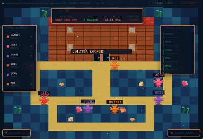

# Lobster Lodge



A pixel-art control panel for [OpenClaw](https://github.com/openclaw/openclaw). Drag your agents around an underwater tilemap, chat with them, spawn new ones, and manage skills -- all from a cozy lodge on the ocean floor.

Lobster Lodge is a supplemental UI that sits alongside the default OpenClaw Control UI. It connects to your gateway over WebSocket using the same protocol, device pairing, and auth as the built-in interface. The difference is vibes: instead of dashboards and tables, your agents are lobsters wandering around a hand-drawn reef.

## What it does

- **The Reef** -- A 22x16 pixel tilemap rendered on a `<canvas>`. Your agents appear as animated pixel lobsters with snapping claws, bobbing antennae, and name tags. Click one to select it, then click a walkable tile to move it around. The ocean has kelp, coral, shell decorations, floating bubbles, and a lodge building with porthole windows.
- **Agent Chat** -- Collapsible chat panel in the bottom-right corner. Pick an agent tab and talk to it. Messages go through the gateway's `agent` request method and stream back via the ack-with-final pattern. Real typing indicators and everything.
- **Spawn Agents** -- Hit "+ SPAWN AGENT" in the status bar. Pick a shell color, give it a designation, preview the deployment specs, and confirm. It calls `agents.create` on the gateway and the new lobster appears on the reef.
- **Edit Agents** -- Select a lobster, click EDIT on the tooltip, change its name or color.
- **Skills Panel** -- Collapsible panel in the bottom-left. Shows all available skills from the gateway, lets you toggle them on/off. Search and filter included.
- **HUD & Tide Log** -- Draggable overlay panels showing mission status, pod size, UTC time, a fake "current strength" indicator, and an activity log of agent events.
- **Draggable Everything** -- Every overlay panel can be grabbed and repositioned. They remember nothing between refreshes and that's fine.
- **Device Pairing** -- On first connect, Lodge generates an Ed25519 keypair, derives a device ID, and goes through the full challenge-response handshake. If the device isn't paired yet, it shows a pairing screen and waits for operator approval. Device tokens are stored per-gateway-host in localStorage.
- **Connection History** -- Recent gateway connections are saved and shown on the login screen for quick reconnect.

## Installation

Lobster Lodge is designed to be dropped into an existing OpenClaw installation. It piggybacks on the gateway's static file server by placing its built assets into a `lodge/` subdirectory of the Control UI root.

```
npx lobster-lodge install
```

That's it. The installer will:

1. Locate your OpenClaw installation (by resolving the `openclaw` binary and walking up to find the package root)
2. Build the Lodge assets if needed
3. Copy them into `<openclaw-root>/dist/control-ui/lodge/`

Then open your gateway in a browser and navigate to `/lodge/` (trailing slash required).

### Manual install

If the automatic installer can't find your OpenClaw installation, you can point it manually:

```
npx lobster-lodge install --openclaw-root /path/to/openclaw
```

Or if you want to build and copy the files yourself:

```
bun run build
cp -r dist/* /path/to/openclaw/dist/control-ui/lodge/
```

### After OpenClaw upgrades

Rebuilding or upgrading OpenClaw will wipe `dist/control-ui/`, which means your Lodge files get deleted. Just run the installer again:

```
npx lobster-lodge install
```

## Development

```
bun install
bun run dev
```

This starts Vite's dev server with hot reload. Lodge will render the login screen where you can enter your gateway's WebSocket URL (e.g. `ws://127.0.0.1:18789`). For development you're connecting directly to the gateway -- no need to install into OpenClaw's file tree.

### Build

```
bun run build
```

Output goes to `dist/`. The build is a standard Vite production build with hash-based routing so it works correctly when served from a subdirectory.

### Lint / Format

```
bun run check
```

Uses [Biome](https://biomejs.dev/) for linting and formatting.

## How it works

Lodge is a single-page React app (React 19, TypeScript, Vite) with zero runtime dependencies beyond React. All the pixel art, animations, and UI are built from scratch with `<canvas>` and inline styles.

The gateway connection is managed by a custom `GatewayClient` class that handles the full OpenClaw WebSocket protocol: challenge-response auth, Ed25519 device signatures, request/response with timeout, event subscriptions, tick keepalive, and automatic reconnection with exponential backoff. During pairing it reconnects on a fixed 3-second interval until the operator approves the device.

The tilemap is a hardcoded 22x16 grid where each cell type (ocean, sand, deep water, lodge wall, shell roof, door, porthole, coral, kelp, shell deco) has its own pixel renderer. Agents move one axis at a time with smooth interpolation. Positions and colors are persisted to localStorage so your lobsters stay where you put them.

## URL note

Because Lodge lives inside the gateway's existing SPA, only the exact path `/lodge/` (with trailing slash) will serve the Lodge `index.html`. All internal routing uses hash-based navigation (`/lodge/#/...`) to avoid collisions with the parent SPA's catch-all fallback.

## License

MIT
